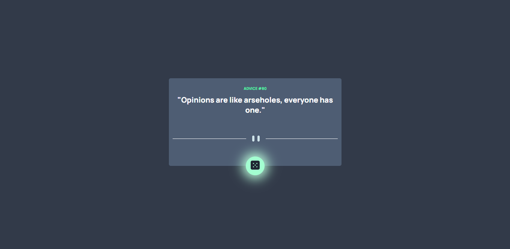

# Frontend Mentor - Advice generator app solution

This is a solution to the [Advice generator app challenge on Frontend Mentor](https://www.frontendmentor.io/challenges/advice-generator-app-QdUG-13db). Frontend Mentor challenges help you improve your coding skills by building realistic projects.

## Table of contents

- [Overview](#overview)
  - [The challenge](#the-challenge)
  - [Screenshot](#screenshot)
  - [Links](#links)
- [My process](#my-process)
  - [Built with](#built-with)
  - [What I learned](#what-i-learned)
  - [Continued development](#continued-development)
  - [Useful resources](#useful-resources)
- [Author](#author)

## Overview

### The challenge

Users should be able to:

- Users should be able to generate new advice each time the button is clicked.
- Users will view the optimal layout for the app depending on their device's screen size

### Screenshot





### Links

- Solution URL:[Click here to see the solution] (https://www.frontendmentor.io/solutions/advice-generator-app-using-reactjs-V3h88hmLi)
- Live Site URL:[Click here to see the live demo] (https://generaterandomadvice.netlify.app/)

## My process

### Built with

- Semantic HTML5 markup
- CSS custom properties
- Flexbox
- [React](https://reactjs.org/) - JS library

### What I learned

```js
<div id={advices.id} className="card-container">
  {loading ? (
    "Loading, please wait"
  ) : (
    <>
      <p className="card-id">ADVICE #{advices.id}</p>
      <p className="card-advice">"{advices.advice}"</p>
      <Previews />
    </>
  )}
</div>
```

in this code, where the ui is displayed. If loading is true then will generate the string. but if it is false then it will generate the id, advices and then the svg image.

### Continued development

i will continue learning css, and ofcourse React.

### Useful resources

- [resource 1](https://www.tutsmake.com/react-get-window-height-width/) - This help me to get the width of the user current screen size dynamicly. i use it in Previews component where I need to generate either the desktop svg or mobile svg.
- [resource 2](https://stackoverflow.com/questions/8639383/how-do-i-center-an-svg-in-a-div) - This StackoverFlow solution helped me in center the svg image within the div.

## Author

- LinkedIn - [@HermawanGan](https://www.linkedin.com/in/hermawan-gan/)
- Frontend Mentor - [@hermawangan](https://www.frontendmentor.io/profile/hermawangan)
